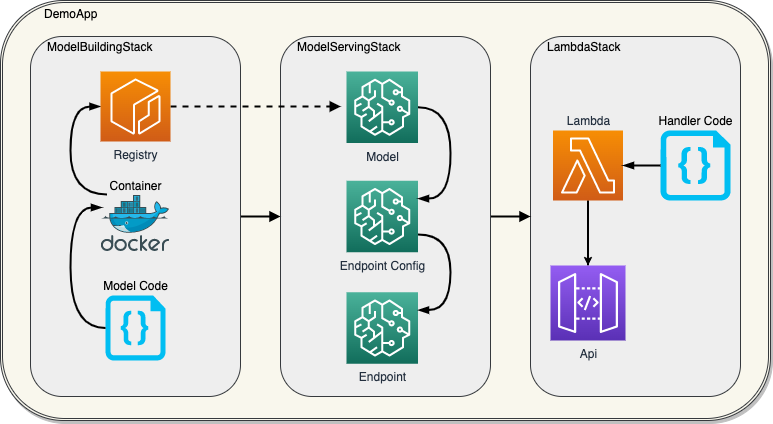

# Template API to host a 🤗 model on AWS SageMaker

Example API to host a [HuggingFace](https://huggingface.co/) model on AWS SageMaker.

- Written in [CDK](https://github.com/aws/aws-cdk)
- Stage management for different scenarios and hosting requirements
- [Serverless](https://docs.aws.amazon.com/sagemaker/latest/dg/serverless-endpoints.html) or instance based SageMaker endpoints
- Easily switch to another 🤗 model: Pre-trained from the model hub or a custom model stored in S3

## TL;DR

**Main commands:**

```bash
make new_stage  # Create a new stage
make deploy     # Deploy a stage
```

Be aware that certain fees will be charged for your AWS account (e.g. for [SageMaker](https://aws.amazon.com/sagemaker/pricing/)). To clean everything up, simply call `make destroy`.

<details><summary><strong>Prerequisites</strong></summary>

- An AWS account and its credentials (we recommend [AWS Vault](https://github.com/99designs/aws-vault) for AWS credentials management)
- [Docker Client](https://docs.docker.com/get-docker/)
- [Node](https://nodejs.org/en/download/) & [Yarn](https://classic.yarnpkg.com/en/)
</details>

## Table of Content

1. [Example Model & API](#example-model--api)
1. [Use a different model](#use-a-different-model)
1. [Infrastructure](#infrastructure)
1. [What remains](#what-remains)

## Example Model & API

There are two stages already configured ([instance](./infrastructure/src/stages/instance.json) and [serverless](./infrastructure/src/stages/serverless.json)). To deploy them, enter your AWS account number and region into the json file. The model used in these stages is [DistilBERT](https://huggingface.co/distilbert-base-uncased-finetuned-sst-2-english) pre-trained for _sentiment classification_. When deploying the model via `make deploy`, cdk will print out the endpoint URL of the API (`DemoAPIStack.ApiEndpoint = https://SOME_UID.execute-api.REGION.amazonaws.com/`). To call the model, you have to make a POST request to the `/demo` path (so the total URL is `https://SOME_UID.execute-api.REGION.amazonaws.com/demo`).

To test the API, enter the URL in your favorite tool to debug REST APIs (like [Postman](https://www.postman.com/) or [REST Client for VS Code](https://marketplace.visualstudio.com/items?itemName=humao.rest-client)). The POST endpoint expects the following body:

```
{
    "inputs": ["I love dogs.", "I am not fond of cats though."]
}
```

The response contains the predicted sentiment for each sentence:

```
{
    "msg": "Request successful.",
    "body": {
        "predictions": [
            "POSITIVE",
            "NEGATIVE"
        ]
    }
}
```

## Use a different model

If you want to host a model other than text classification, you need to adjust the [model handler file](./model/src/inference/handler_service.py). The `initialize` function specifies how the model is loaded and the `inference` function specifies how predictions are made and transformed into human-readable output.

To load a model from an S3 path in which the weights and configuration are stored, enter the path during the stage creation or use the `modelS3Path` key in the stage json configuration.

## Infrastructure

The infrastructure consists of three stacks.



### ModelBuildingStack

The [ModelBuildingStack](./infrastructure/src/model-building-stack.ts) first checks whether the ECR repository with the name specified in `modelDockerImage` exists in the current account and region and if not creates it. It then builds the [Docker container](./docker/Dockerfile.serve) in `/docker/Dockerfile.serve` that specifies how the model is hosted. This docker image is then pushed to the repository with the `latest` tag.

The Docker image asset automatically recognizes when the Dockerfile has changed - and so its copied content from the `model` folder as well. So only in that case a new deployment is made.

### ModelServingStack

The [ModelServingStack](./infrastructure/src/model-serving-stack.ts) creates the SageMaker Model, Endpoint Configuration, and Endpoint. The model as well as the Endpoint Configuration are always newly created and have the current timestamp in their name (`${modelName}-MODEL-${time}` and `${modelName}-CONFIG-${time}`). This is due to the fact, that these resources can not be updated but merely deleted and newly created. The model is based on the docker image created and pushed in the first step and the weights that are specified in `modelDataLocation`. There are two options for the endpoint configuration. A [serverless configuration](https://docs.aws.amazon.com/sagemaker/latest/dg/serverless-endpoints.html) can be configured with the `endpointMemorySize` (default 4096) and `endpointMaxConcurrency` (default 2) properties. The instance based configuration can be configured by specifying the [instance type](https://docs.aws.amazon.com/sagemaker/latest/dg/notebooks-available-instance-types.html) with `instanceType` and `instanceCount` (default 1).

This stack is mostly build according to [this template](https://github.com/aws-samples/amazon-sagemaker-model-serving-using-aws-cdk/blob/main/bin/stack/model-serving/model-serving-stack.ts).

### DemoAPIStack

The [DemoAPIStack](./infrastructure/src/demo-api-stack.ts) is the actual API Lambda Stack. It creates one HTTP endpoint `/demo` with the respective [source code](./lambdas/src/endpoints/demo/handler.ts). This code calls the respective SageMaker Endpoint and returns its response.

## What remains

This repository is kept short and simple to demonstrate the core functionality of such an API without losing the overview. To turn this into a production-ready API you might want to consider some of the following aspects.

- Authorization
- Domain Routing
- Continuous Integration/Development
- Testing & Linting
- Caching
- GPU Tweaks
- OpenAPI Specifications
- ML Monitoring

If you have questions regarding one of these aspects, create an issue or reach out to Richard from how.fm.
